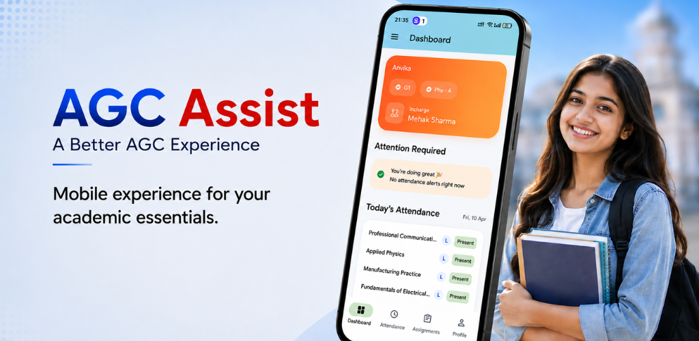
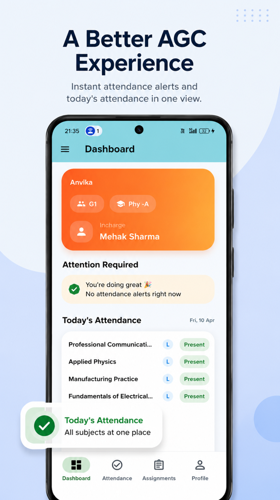
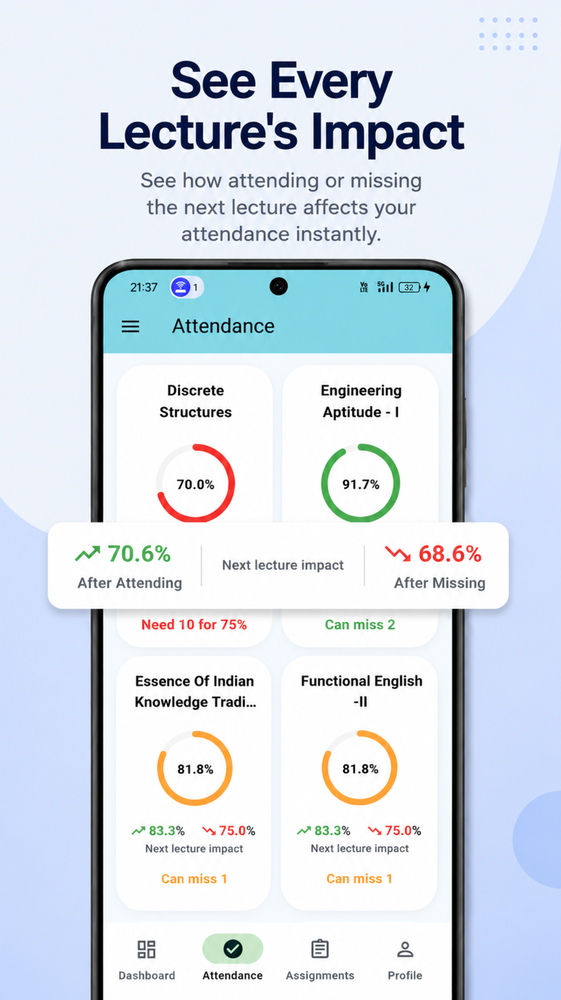
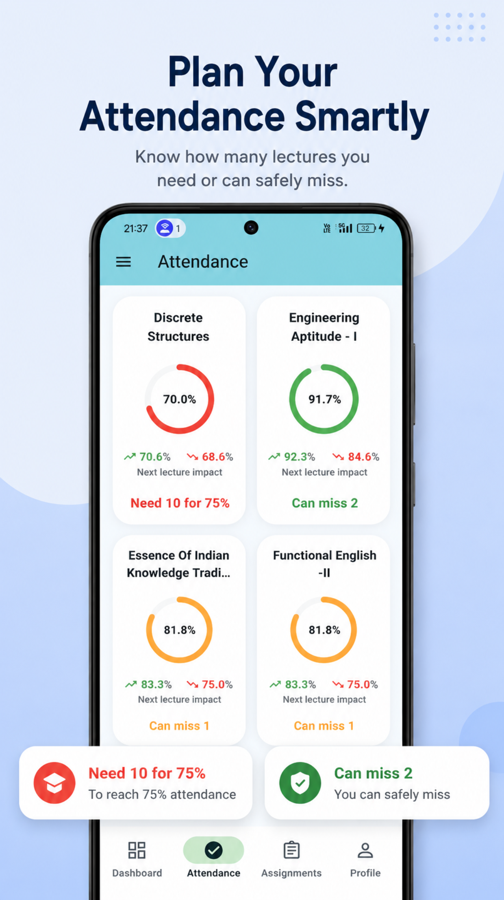
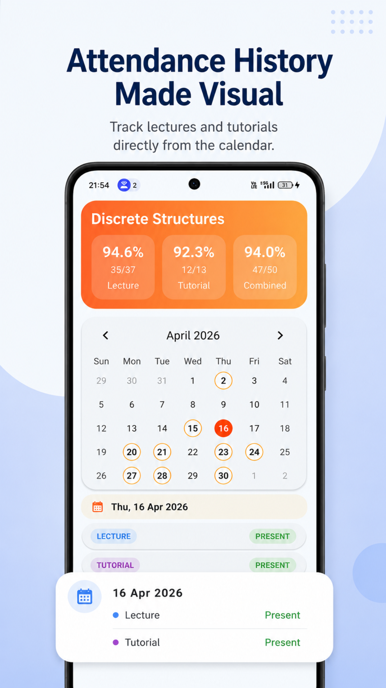
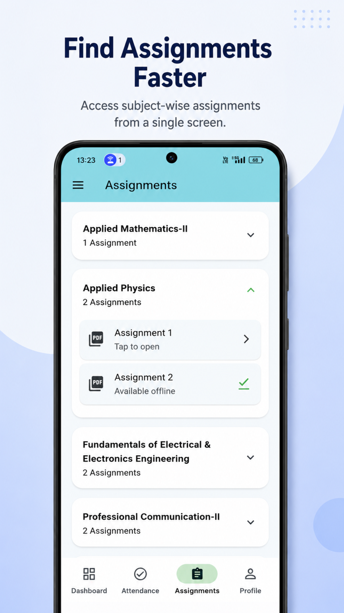
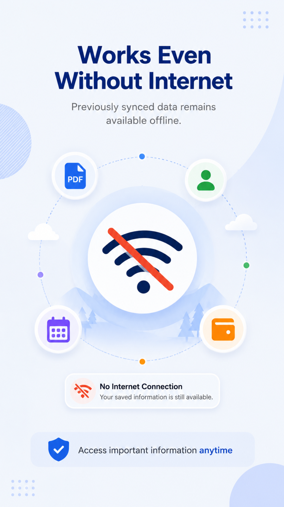
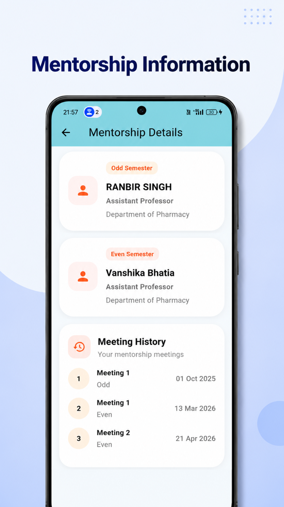
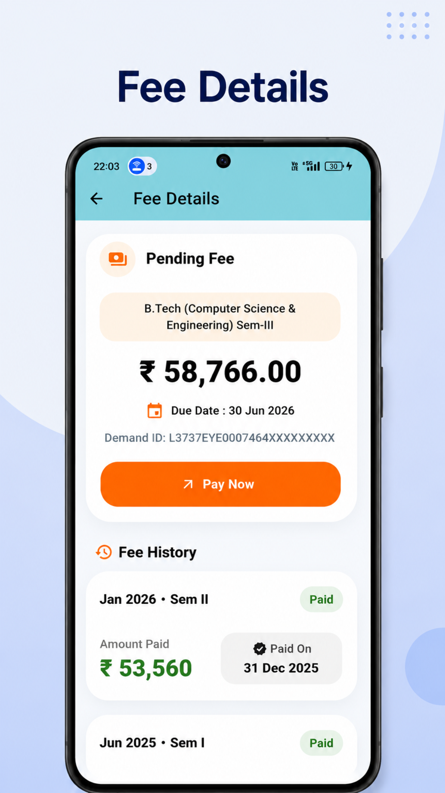

<div align="center">

# AGC Assist

### A Better AGC Experience

Mobile experience for your academic essentials.



</div>

---

## 📱 About AGC Assist

AGC Assist is an unofficial student companion application designed for students of Amritsar Group of Colleges (AGC).

Instead of repeatedly navigating through the college portal, students can access attendance, assignments, mentorship information, fee details, and academic insights through a modern mobile-first experience.

The application focuses on convenience, speed, and offline accessibility while providing features that help students better understand and manage their academic progress.

---

## ✨ Highlights

✅ Today's attendance in one view

✅ Attendance impact prediction

✅ Attendance recovery insights

✅ Safe lecture miss calculations

✅ Interactive attendance calendar

✅ Assignment management

✅ Automatic assignment downloads

✅ Offline access

✅ Mentorship details

✅ Fee details

✅ Mobile-friendly experience

✅ Google Play Closed Testing

---

# 🚀 Features

---

## 📋 Today's Attendance At A Glance

View attendance updates from all subjects in a single card.

No need to open individual subjects one by one.



---

## 📈 See Every Lecture's Impact

Instantly understand how attending or missing the next lecture affects your attendance percentage.

Plan your attendance with confidence.



---

## 🎯 Plan Your Attendance Smartly

Know:

- How many lectures you need to reach 75%
- How many lectures you can safely miss



---

## 📅 Attendance History Made Visual

Track attendance records through an interactive calendar view.

Quickly navigate between dates and review lecture/tutorial attendance history.



---

## 📚 Find Assignments Faster

Access all assignments from a single screen.

Features include:

- Subject-wise organization
- Quick access
- Offline availability
- Assignment downloads



---

## 🌐 Works Even Without Internet

Previously synchronized data remains available offline.

Students can continue viewing important information even when the portal is unavailable.



---

## 👨‍🏫 Mentorship Information

View:

- Mentor details
- Semester-wise mentors
- Meeting history

All in a clean and accessible format.



---

## 💳 Fee Details

Quickly access:

- Pending fees
- Payment history
- Due dates
- Payment references



---

# 🏗️ Technical Overview

## Frontend

- Flutter
- Dart

## Local Database

- Hive

## Data Processing

- Web Authentication
- HTML Parsing
- Local Data Caching

## State Management

- setState
- ValueNotifier

## Platform

- Android

---

# 🔄 Application Flow

```text
Student Login
       │
       ▼
College Portal Authentication
       │
       ▼
Fetch Academic Data
       │
       ▼
HTML Parsing
       │
       ▼
Data Models
       │
       ▼
Hive Local Storage
       │
       ▼
Offline Access & Insights
       │
       ▼
Flutter User Interface
```

---

# 🎓 Project Objectives

The objective of AGC Assist is to provide students with:

- Faster access to academic information
- Better attendance awareness
- Assignment accessibility
- Offline support
- Improved mobile experience

while reducing dependency on repetitive portal navigation.

---

# 📦 Key Technical Features

- Attendance Analytics
- Lecture Impact Prediction
- Attendance Recovery Calculations
- Safe Miss Calculations
- Offline First Architecture
- Assignment Auto Download
- Local Data Persistence
- Play Store Distribution
- Closed Testing Deployment

---

# ⚠️ Disclaimer

AGC Assist is an unofficial student companion application.

This project is not affiliated with, endorsed by, or officially maintained by Amritsar Group of Colleges.

All academic information originates from the respective institutional portal.

---

# 🔐 Privacy Policy

Visit:

**https://varinder56.github.io/appli-site/privacy_policy.html**

---

# 👨‍💻 Developer

### Sunshine

Flutter Developer

AGC Assist — Unofficial Student Companion for AGC

---

<div align="center">

### Built with Flutter ❤️

</div>